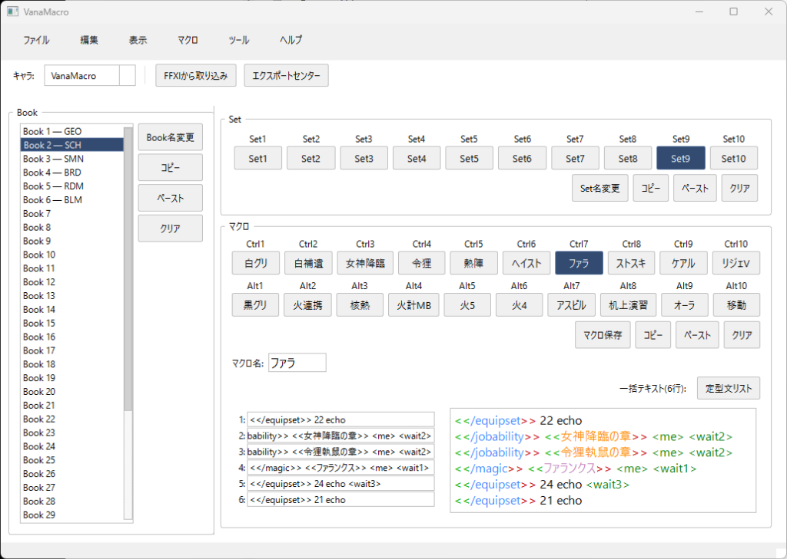

# VanaMacro 外部エディタ README
FFXI のマクロを PC 上で編集・管理し、必要に応じて FFXI 形式（mcr*.dat / mcr.ttl）へエクスポートするためのツールです。UI で扱うデータは `macros/macros_<キャラID>.json`（Book 40 × Set 10 × Ctrl/Alt × 10 スロット、各 6 行）で管理します。

## 多言語対応
VanaMacro は **日本語** と **英語** の UI に対応しています。

### UI言語の切り替え
- **言語切替**: メニュー「ツール」→「言語設定...」から言語を選択できます。
- **即時反映**: 言語を変更すると、メニュー・ボタン・ダイアログなどのUI要素が即座に切り替わります。
- **設定の保存**: 言語設定は `config.json` に保存され、次回起動時も維持されます。

### マクロ内の定型文について
- **両言語対応のエンコード**: マクロ内の定型文（`<<定型文>>`）は、日本語でも英語でも正しく FFXI 形式に変換されます。
  - 日本語設定でも `<<Vallation>>` → 正しくエンコード
  - 英語設定でも `<<ヴァレション>>` → 正しくエンコード
- **言語切り替え時の自動変換**: 言語設定を変更すると、マクロ内の定型文を新しい言語に変換するか確認されます。
  - 例: ja → en に変更時、`<<ヴァレション>>` → `<<Vallation>>` に自動変換
  - 変換後は JSON に保存され、エクスポート時も新しい言語で出力されます
- 定型文リストダイアログの検索・挿入機能は、UI言語に応じた辞書を使用します。

## ディレクトリ概要
- `macros/` … UI が編集・保存する JSON スナップショット。
- `data/backup` … `storage.backup_and_prepare_edit()` が作る世代バックアップ。
- `data/edit` … バックアップ展開先。取り込み時のテンプレートにも使用。
- `data/export/<ID>/<timestamp>/` … エクスポート結果（mcr*.dat / mcr.ttl / manifest / JSON スナップショットなど）。
- `autotrans_data/` … 定型文・アイテム辞書（`autotrans.db`, `resources.db`）と、`tools/`（`sync_auto_tables.py`, `sync_resources.py`）。

## 起動と基本フロー

### 起動方法
FFXI USER フォルダ（`C:\Program Files (x86)\...`）へのコピーには**管理者権限**が必要です。  
以下のいずれかの方法で起動してください：

- **`VanaMacro.vbs`**（推奨）: ダブルクリックで管理者権限付きで起動。
- **`python main.py`**: 管理者権限のコマンドプロンプトから実行。

### 基本フロー
1) 起動すると、FFXI USER フォルダがあればバックアップ＋展開（なければスキップ）。  
2) UI でキャラを選択すると `macros_<id>.json` を読み込み、Book/Set/マクロを表示。保存先も常にこの JSON。  
3) 必要に応じてエクスポートセンターから `.dat` / `.ttl` を生成し、FFXI USER へコピー（上書き確認あり）。

### 初回起動時の注意
初めてツールを使用する場合（または新しいキャラクターを追加した場合）、マクロデータは空の状態です。  
**FFXIのマクロを読み込むには、ツールバーの「FFXIから取り込み」ボタンを押してください。**  
これにより、FFXI のマクロファイル（mcr*.dat）が解析され、JSON に保存されます。

## UI 操作のポイント
- **メニューバー & ツールバー**: 上部に標準的なメニューバー（ファイル、編集、表示、マクロ、ツール、ヘルプ）とツールバー（キャラ選択、FFXI取込ボタン、エクスポートセンターボタン）を配置しました。
- **データ保護機能**:
    - **編集中の保持**: 同じブック内であれば、マクロやセットを切り替えても編集中の内容はメモリ上に保持されます（保存し忘れによる消失を防ぎます）。
    - **未保存警告**: ブック変更、キャラ変更、アプリ終了など、現在のコンテキストを離れる際に未保存の変更がある場合、確認ダイアログが表示されます。
- **Book/Set/マクロ選択**: 左ペイン Book、右上 Set ボタン、Ctrl/Alt マクロボタンで切替。
- **キャラクター管理**: ツールバーの「管理」ボタン（またはメニュー「ツール」→「キャラクター管理」）から、キャラクターの表示名を変更できます。フォルダ名（ID）は変更されず、ツール上の表示名のみが変わります。
- **セット名変更**: ツール内表示用ラベルのみ（FFXI 本体には反映されません）。
- **編集エリア**: 左が 6 行入力、右が一括テキスト。内容は常時双方向同期で、どちらを編集しても即反映。
- **マクロ操作**: 「マクロ保存」で JSON に保存。コピー/ペースト/クリアはツール内クリップボード。
- **テーマ切替**: 表示メニューから「Base」「Dark」「Game」テーマを選択可能。
- **定型文**: 「定型文リスト」から検索→挿入。ひらがな/カタカナ/ローマ字で入力すると自動的にひらがなへ正規化し、`pykakasi` + ゲーム固有辞書で漢字候補（例: うつせみ→空蝉の術）を検索できます。漢字で入力した場合は表記一致でヒットします。
- **入力補助**:
	- `/` または `<` 入力直後、および Ctrl+Space でコマンド/ターゲットの補完リストが表示されます。
	- 候補は FFXI のテキストコマンド＋ターゲット語彙から生成し、使用頻度が高いものを上位に固定しています。
	- キー入力・ペースト・IME いずれでも全角スペースは自動的に半角へ変換され、ゲーム内仕様と揃います。
- **オートトランス展開・補完**: `autotrans_data/`

## エディタ支援機能
- シンタックスハイライト: コマンド、ターゲット、定型文括弧（<< / >>）、引用符内文字列、コメントを基本色で表示。
- バトル関連語の色分け: ジョブアビリティ > 魔法 > ウェポンスキル > 条件付き JA > ペットコマンドの優先順位で重複を避けつつハイライトします。魔法には、歌/忍術/召喚/青魔/風水に加え、敵専用魔法（Curse など）は自動除外しています。
- コマンド辞書: `/` で始まる語は FFXI 正式コマンドのみを照合。
- 補完機能: `/`・`<`トリガーや Ctrl+Space でポップアップが開き、上下キーで確定できます。ハイライト対象と同じ辞書を使うため、誤ったスペルや未登録コマンドは候補に出ません。
- 行エラーチェック: 1 行 60 バイト（cp932換算）を超える場合や Shift-JIS 変換不能文字が含まれる場合は波下線で警告します。

## キーボードショートカット
| カテゴリ | ショートカット | 機能 |
|---------|---------------|------|
| **ファイル** | Ctrl+I | FFXIから取り込み |
| | Ctrl+E | エクスポートセンター |
| | Ctrl+Q | 終了 |
| **表示** | Ctrl+0 | レイアウトをリセット |
| **マクロ** | Ctrl+S | マクロを保存 |
| | Ctrl+Shift+C | マクロをコピー |
| | Ctrl+Shift+V | マクロをペースト |
| | Ctrl+Shift+D | マクロをクリア |
| | Ctrl+T | 定型文リスト |

※ ヘルプメニュー「ショートカット一覧...」からも確認できます。

## 取り込み・エクスポート
- 取り込み: USER フォルダや `data/edit/<ID>` の mcr*.dat/mcr.ttl を読み込み、`macros_<id>.json` に展開。
- エクスポート: `exporter.export_character_macros` を通じて `.dat` / `.ttl` を生成。manifest に検証結果を記録し、必要に応じて USER へコピー。

## 辞書更新（定型文・アイテム）
- **データベース方式**: 定型文とアイテム辞書は `autotrans_data/autotrans.db` (SQLite) で管理されます。
- **辞書の再生成**: `autotrans_data/tools/sync_auto_tables.py` から `autotrans.db` を生成します。
- **FFXI アップデート後の更新手順**:
  1. 最新の `auto_translates.lua` と `items.lua` を `autotrans_data/res/` に配置
  2. `python autotrans_data/tools/sync_auto_tables.py` を実行
  3. 新しい `autotrans.db` が自動的に生成されます
- **多言語対応**: データベースには日本語 (ja) と英語 (en) の両方のデータが含まれています。

## 運用上の注意
- **取り込み時の安全性**: 「FFXIから取り込み」を実行すると現在の JSON データは上書きされますが、実行直前に**自動的に「エクスポート」処理が走り、全データのスナップショットが保存されます**（`data/export/<ID>/<日時>/`）。万が一の際はここから復元可能です。
- **Book名の反映**: VanaMacro 上で Book名を変更しても、**FFXI ゲーム内には反映されません**。Book名の変更はゲーム内で行ってください。マクロの内容（テキスト）は正常に反映されます。
- Set名変更はツール内の見出し用として利用してください。
- エクスポート前後は必要に応じて manifest や UI 上の検証結果を確認してください。

### マクロの反映タイミング
FFXIのマクロファイルはキャラクターログイン時にメモリに読み込まれ、**ログアウト時にファイルへ書き戻されます**。  
そのため、ゲームプレイ中にファイルを上書きしても、ログアウト時にFFXI側で上書きされ変更が消えてしまいます。  

マクロの変更を反映するには、以下の手順で行ってください：
1. FFXIで**ログアウト**（キャラクター選択画面に戻る or ゲーム終了）
2. VanaMacroで**エクスポート＆コピー**
3. FFXIで**キャラクターを選択してログイン**

## エクスポート手順（詳説）
1. メニューバー「ファイル」→「エクスポートセンター」を開く。
2. 対象キャラを確認し、必要なら事前に「マクロ保存」で最新状態を JSON に反映。  
3. 出力先テンプレート（`data/edit/<ID>` など）と保存先 `data/export/<ID>/<timestamp>/` を確認。  
4. 「エクスポート実行」を押下すると、`exporter.export_character_macros` が `.dat`/`.ttl` を生成し manifest に検証結果を残す。  
5. **FFXI への反映**: エクスポート完了後、画面下部の「FFXI USER フォルダへコピー（上書き）」ボタンを押すことで、生成したファイルを FFXI USER フォルダへコピーできます。**FFXI 側への上書きは、このボタン操作でのみ行われます。**
6. 必要に応じて manifest の `verified` が `True` になっているかを確認してから実機へ配置。

## 操作スクリーンショット（参考）

| メイン画面（ライトモード） | メイン画面（ダークモード） |
|:---:|:---:|
|  |  |

- **UI メイン画面**: 上部にメニューバーとツールバー。左に Book/Set/マクロ選択、右に 6 行 + 一括テキストの編集エリア。
- **定型文リスト**: カテゴリ/検索/結果リストの 3 ペインで、検索窓はひらがな・英字・カタカナ対応（漢字は表記一致）。  
- **エクスポートセンター**: 出力先とオプションを確認して実行するダイアログ。

## 動作環境・依存ライブラリ
- Python 3.13 以降
- PyQt6（UI/ハイライト/補完機能）
- pykakasi（定型文検索用の読み変換）
- その他: `autotrans_data/tools` から生成された辞書ファイル

## 利用上の注意
本ツールは個人の趣味の範囲での利用を前提として開発されています。以下の行為はご遠慮ください。

- 本ツール（修正版を含む）の転売・有償配布
- 有料ツールパッケージへの同梱
- その他、営利を目的とした利用

利用者は自己の責任において本ツールを使用するものとします。

